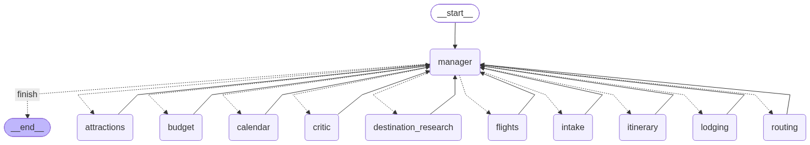

<div align="center">

# ✈️ Autonomous Trip Planner

**Eleven specialist agents that plan a real trip — from one sentence to your Google Calendar.**

`LangGraph` · `Gemini 3.5 Flash` · `Pydantic` · `MCP` · `Gradio` · grounded in live travel data

[🏗 Architecture](#-architecture) · [🤖 Agents](#-the-eleven-agents) · [🧰 Tools](#-the-tool-layer) · [🔌 MCP](#-mcp--google-calendar) · [🖥 Interface](#-the-interface) · [🎯 Principles](#-two-design-principles) · [🧪 Tests](#-tests) · [🚀 Start](#-quick-start)

</div>

---

## 💡 What it does

You write one sentence:

> *"I want to travel to Lisbon from 2026-09-10 to 2026-09-15. We are 2 travelers flying from Tel Aviv, our budget is 3000 USD, and we love food, history and walking tours."*

Eleven agents turn it into a trip that actually works — real flights at real
prices, a real hotel, real museums with their real closing days, arranged into
days you can genuinely walk, costed against your budget, fact-checked, written
up, and written **straight into your Google Calendar** over MCP.

**Nothing in the output is invented.** Every flight, hotel, place and price
comes from a live API call, and every agent is told the same thing: *if the
tool did not return it, do not report it.*

---

## 🏗 Architecture

### The topology — a hub, not a chain

Specialists never call each other. Each one answers to the manager and returns
a typed result.

```
                    ┌───────────────────────────────┐
        ┌──────────▶│      🧭  TRAVEL  MANAGER      │◀──────────┐
        │           │   decides what runs next      │           │
        │           └───────────────┬───────────────┘           │
        │                           │                           │
        │  ② structured result      │  ① delegates to           │
        │     flows back            │     exactly one           │
        │                           ▼                           │
        │   ┌───────────────────────────────────────────────┐   │
        └───┤  📋 Intake      🌍 Research     ✈️ Flights     ├───┘
            │  🏨 Lodging     📍 Attractions  🗺 Routing     │
            │  💰 Budget      🔍 Critic       📖 Itinerary   │
            │  📅 Calendar                                   │
            └───────────────────────────────────────────────┘
```

### The order — a pipeline with one loop back

Each stage consumes the previous one's output, so the sequence is fixed in
code. The Critic is a real gate: a blocker sends the plan back to be rebuilt.

```
 START
   │
   ▼
 📋 Intake ─▶ 🌍 Research ─▶ ✈️ Flights ─▶ 🏨 Lodging ─▶ 📍 Attractions
                                                              │
   ┌──────────────────────────────────────────────────────────┘
   ▼
 🗺 Routing ─▶ 💰 Budget ─▶ 🔍 Critic ──── approved? ──── ✅ ──▶ 📖 Itinerary
   ▲                            │                                    │
   └────────── ❌ blocker ──────┘                                    ▼
        (issues attached, max 2 revisions)                     📅 Calendar
                                                                    │
                                                                    ▼
                                                                   END
```

<div align="center">

<br><sub>The compiled graph — rendered by <code>scripts/draw_graph.py</code></sub>
</div>

### 🔗 How the pieces connect

**Every agent is a graph node** that does exactly three things — read, run, return:

```python
def flights_node(state: TripState) -> dict:
    profile = state["intake"].profile        # 1️⃣  read what it needs
    result  = agent.invoke(...)              # 2️⃣  run the agent + its tools
    return {                                 # 3️⃣  return a partial update
        "flights": result["structured_response"],
        "completed_agents": [AgentName.FLIGHTS],
    }
```

Nodes never mutate state and never call each other — LangGraph merges the
updates. Adding a twelfth agent means **one node, one edge, one routing
entry**. Nothing else changes.

**Every message is a validated Pydantic model.** `TripState` holds one typed
slot per agent:

```python
class TripState(TypedDict, total=False):
    user_request: str                                    # kept verbatim
    intake: IntakeResult                                 # 📋 agent 2
    research: DestinationResearch                        # 🌍 agent 3
    flights: FlightsResult                               # ✈️ agent 4
    ...                                                  #    one slot each
    completed_agents: Annotated[list[AgentName], operator.add]
    revision_count: int                                  # bounds the loop
```

Routing never reads Attractions' prose — it reads `AttractionsResult.places`,
a list of validated `Place` models. **Malformed output is rejected at the
boundary** instead of surfacing three stages later as a mystery.

---

## 🤖 The eleven agents

| # | Agent | Responsibility | 🧰 Tools | 📤 Returns |
|:--:|---|---|---|---|
| 1 | 🧭 **Travel Manager** | Orchestrates. Decides which stage runs next — never plans anything itself. | `read_trip_state` `delegate_to_agent` | `ManagerDecision` |
| 2 | 📋 **Intake** | Turns free text into a structured profile. Refuses to guess what wasn't said. | `validate_required_fields` `ask_clarifying_question` | `IntakeResult` |
| 3 | 🌍 **Destination Research** | Weather, safety, currency, transport, entry rules — every claim cited. | `tavily_search` `get_weather` `get_entry_requirements` `get_currency_info` | `DestinationResearch` |
| 4 | ✈️ **Flights** | Searches live fares, ranks them, recommends one with honest trade-offs. | `search_flights` `compare_flights` `get_flight_details` | `FlightsResult` |
| 5 | 🏨 **Lodging** | Finds real stays and *measures* whether "central" is actually true. | `search_hotels` `get_hotel_details` `check_hotel_location` `compare_hotels` | `LodgingResult` |
| 6 | 📍 **Attractions** | Builds the pool of candidate places, with real opening hours and closing days. | `web_search` `search_places` `get_opening_hours` `get_place_details` | `AttractionsResult` |
| 7 | 🗺 **Routing** | Clusters places into days you can walk, and times each stop. Fixes what the Critic rejects. | `calculate_distance` `calculate_travel_time` `cluster_locations` `check_opening_hours` | `RoutingResult` |
| 8 | 💰 **Budget** | Totals every category, converts currencies, proposes cuts when over. | `calculate_total_cost` `convert_currency` `estimate_food_cost` `estimate_local_transport_cost` `suggest_cheaper_alternatives` | `BudgetResult` |
| 9 | 🔍 **Critic** | The gate. Verifies the plan is real, possible and within limits. | `verify_place` `verify_opening_hours` `validate_schedule` `validate_budget` | `CriticResult` |
| 10 | 📖 **Itinerary** | Merges everything into the one document a person actually reads. | `read_agent_results` `build_daily_itinerary` `format_trip_plan` | `ItineraryResult` |
| 11 | 📅 **Calendar** | Writes the approved plan into the traveler's real Google Calendar — **tools discovered live over [MCP](#-mcp--google-calendar)**. | *from the MCP server* · falls back to `create_calendar_event` `update_event` `export_ics` | `CalendarResult` |

### 🛡 What keeps them honest

Each agent carries one rule that is enforced in **code, not in its prompt**:

| Agent | The guard |
|---|---|
| 🧭 Manager | Stops when intake is incomplete · caps revisions at **2** |
| 📋 Intake | Required-field logic is Python — completeness is never a matter of opinion |
| 🌍 Research | Every source must be one a tool actually returned |
| ✈️ Flights | Ranking is arithmetic — `price` ≫ `duration` > `stops` — so it's reproducible |
| 🏨 Lodging | Coordinates copied through unchanged, because Routing depends on them |
| 📍 Attractions | A place without coordinates is dropped — Routing can't schedule it |
| 🗺 Routing | Every place is scheduled **or** listed as unscheduled — nothing vanishes |
| 💰 Budget | Totals come from the tool, never the model. Cuts capped at 30% per category |
| 🔍 Critic | A failed *verification* is not evidence of a *problem* |
| 📖 Itinerary | May not add a place, price or flight the others didn't produce |
| 📅 Calendar | Rejects events ending before they start, or with unparseable times |

---

## 🧰 The tool layer

**38 tools across 11 agents.** Each is a plain function whose docstring *is*
its contract with the model.

### 🌐 Where the data comes from

| Source | 🔎 Provides | Used by |
|---|---|---|
| 🛫 **SerpApi** · Google Flights | Live fares, legs, layovers, baggage | ✈️ Flights |
| 🏩 **SerpApi** · Google Hotels | Real rates, ratings, coordinates, amenities | 🏨 Lodging |
| 🗺 **SerpApi** · Google Maps | Places, coordinates, **per-weekday opening hours** | 📍 Attractions · 🔍 Critic |
| 💱 **SerpApi** · Google Search | Live currency conversion | 💰 Budget |
| 🔦 **Tavily** | Weather, safety, visas, events, seasonal advice | 🌍 Research · 📍 Attractions |
| 📐 **geopy** | Geodesic distance + travel-time estimates | 🏨 Lodging · 🗺 Routing |
| 🧮 **scikit-learn** | k-means clustering of places into days | 🗺 Routing |
| 🔌 **MCP** · Google Calendar | Real calendar events, OAuth handled by the server | 📅 Calendar |
| 📆 **icalendar** | `.ics` generation — the offline fallback | 📅 Calendar |

### 🧩 Two shared helpers

| Module | What it does |
|---|---|
| `tools/serp.py` | One lazily-built SerpApi client. Failures return `{"error": ...}` instead of raising — **one bad lookup degrades a single tool call, not the whole run**. |
| `tools/geo.py` | Distance and travel time. Straight-line distance × **1.3** (city-grid detour), at 🚶 4.5 · 🚇 15 · 🚕 22 km/h. |

### ⚠️ Failure is a first-class outcome

Every networked tool returns a structured error rather than throwing, and every
prompt says the same thing:

> *If the search returns an error or no results, return an empty list and say so
> plainly in `reasoning`. Do not fabricate a fallback.*

An honest **"no flights found"** is a correct answer. An invented flight number
is not.

---

## 🔌 MCP · Google Calendar

The Calendar Agent does not contain a single line of Google API code. Instead it
speaks **[Model Context Protocol](https://modelcontextprotocol.io)** to a
calendar server that owns the OAuth flow and the API calls, and **discovers the
available tools at runtime**.

```
  📅 Calendar Agent
        │
        │  discovers tools at runtime — never hard-codes them
        ▼
  ┌──────────────────────────────────────┐
  │  🔌 MCP client (stdio)               │
  │     langchain-mcp-adapters           │
  └──────────────┬───────────────────────┘
                 │ spawns via npx
                 ▼
  ┌──────────────────────────────────────┐
  │  🗓 @cocal/google-calendar-mcp        │
  │     owns OAuth · owns the API calls  │
  └──────────────┬───────────────────────┘
                 ▼
          Google Calendar ✅
```

### Why this is more than a wrapper

| | |
|---|---|
| 🔍 **Runtime discovery** | The agent asks the server what it can do. Its system prompt is **built from the tool list that comes back**, so the agent adapts to whatever server you point it at. |
| 🔐 **Auth stays outside the app** | The MCP server owns the OAuth dance and the token refresh. No Google credentials are ever handled by agent code. |
| 🔄 **Swappable backend** | Point `CALENDAR_MCP_ARGS` at a different server — Outlook, CalDAV, anything — and agent #11 keeps working unchanged. |
| 🛟 **Never a hard dependency** | No server configured, Node missing, OAuth not granted? It logs the reason and falls back to `.ics`. **The planner always produces a calendar.** |

### ⚙️ Setting it up

Google Calendar is **opt-in**. Without it everything still works — you get a
`.ics` file instead.

**1 · Get OAuth credentials** *(one time, ~3 minutes)*

1. [Google Cloud Console](https://console.cloud.google.com/) → create or pick a project
2. Enable the **Google Calendar API**
3. **Credentials → Create credentials → OAuth client ID → Desktop app**
4. Download the JSON as `gcp-oauth.keys.json`

**2 · Point the planner at it** — in `.env`:

```ini
CALENDAR_MCP_ENABLED=true
GOOGLE_OAUTH_CREDENTIALS=C:/path/to/gcp-oauth.keys.json
```

**3 · Run it.** The first run opens a browser once to grant access. Requires
[Node.js](https://nodejs.org) on `PATH` — the server is fetched by `npx`, with
nothing to install.

> 💡 Check which backend is live at any time:
> ```bash
> uv run python -c "from trip_planner.mcp_client import describe_calendar_backend; print(describe_calendar_backend())"
> ```

---

## 🖥 The interface

```bash
uv run app.py
```

A Gradio app that **streams the graph** — you watch each of the eleven agents
finish rather than staring at a spinner for two minutes.

```
  ┌────────────────────────────────────────────────────────────┐
  │  ✈️  Autonomous Trip Planner                                │
  │      eleven agents · live data · straight to your calendar │
  ├────────────────────────────────────────────────────────────┤
  │  Describe your trip …                      [ ✨ Plan ]      │
  ├────────────────────────────────────────────────────────────┤
  │  📋✓  🌍✓  ✈️✓  🏨✓  📍✓  🗺●  💰  🔍  📖  📅            │
  │                          ↑ running                          │
  ├────────────────────────────────────────────────────────────┤
  │  📖 Itinerary │ ✈️ Flights │ 🏨 Stay │ 📍 Places │ 💰 …    │
  │                                                             │
  │  ## Day 1 — 2026-09-10: Old town                            │
  │  • 10:00–12:00  Gulbenkian Museum  (11 min walking)         │
  └────────────────────────────────────────────────────────────┘
```

| | |
|---|---|
| 🔴 **Live progress** | Eleven chips track the pipeline — idle, ⚡ running, ✓ done — updated from `graph.stream()` as each node returns |
| 🗂 **Nine result tabs** | Itinerary · Flights · Stay · Places · Budget · Review · Calendar · Your request · Destination |
| 🔄 **Revision aware** | Shows when the Critic sends the plan back, and which revision it is on |
| 📎 **One-click calendar** | Download the `.ics`, or see events land in Google Calendar |
| 🛑 **Honest failures** | An exhausted Gemini quota is explained in plain language, not a stack trace |
| 🌗 **Light & dark** | Custom indigo→violet→pink theme that follows the system setting |

Rendering lives in `render.py`, apart from the UI, so the panels are covered by
the offline test suite.

---

## 🎯 Two design principles

Both are deliberate departures from *"let the model figure it out"* — because
the alternative produces plans that read beautifully and collapse on contact
with a real city.

### 1️⃣ The stage order is code, not a prompt

```python
def next_required_agent(state: TripState) -> AgentName | None:
    if intake is not None and not intake.is_complete:
        return None                       # ⛔ cannot plan without a destination

    if critic and not critic.approved and revisions < MAX_REVISIONS:
        return AgentName.ROUTING          # 🔄 rejected → go fix it

    for agent in AGENT_SEQUENCE:          # ➡️ otherwise, next unfinished stage
        if agent not in completed:
            return agent
    return None
```

The manager agent still runs, and its `reasoning` is what the traveler reads —
but **its routing choice is overridden by the rules**. A confused model cannot
book hotels before it knows the destination, skip the Critic, or loop forever.

### 2️⃣ Arithmetic belongs in tools, not in the model

Ranking, distances, clustering, totals and overlap detection are all plain
Python.

> 🧠 **The agents decide *what matters*. 🔧 The tools decide *what is possible*.**

Ask a language model whether an 11-minute walk fits a 5-minute gap and it will
confidently say yes. `validate_schedule` says:

```
❌ Starts at 11:35, but leaving 'Castelo de São Jorge' at 11:30
   plus 11 min of travel means arriving no earlier than 11:41.
```

That is the difference between a plan that reads well and a plan that works.

---

## 🧪 Tests

**69 tests in two layers** — a fast one for every change, a live one to prove
it works against reality.

```bash
uv run pytest tests -m "not live"   # ⚡ 61 tests · ~7s · no network, no keys
uv run pytest tests                 # 🌐 + 8 live tests against real APIs
```

### ⚡ Layer 1 — structure & logic · 61 tests, offline

| Suite | # | What it pins down |
|---|:--:|---|
| 🔀 `TestSequencing` | 7 | Stage order, the revision loop, the cap that stops it looping forever |
| 🗺 `TestRoutingTools` | 7 | Distance, travel time, clustering, closing-day detection |
| 🔍 `TestCriticTools` | 7 | Overlaps, ignored travel time, out-of-hours stops, empty days, budget breaches |
| 📅 `TestCalendarTools` | 5 | Valid `.ics` output; rejects impossible and unparseable times |
| 💰 `TestBudgetTools` | 5 | Totals, overage, itemized meals, savings targeting |
| 🏗 `TestGraphStructure` | 4 | All 11 nodes exist; every specialist reachable from *and* returning to the manager |
| 📋 `TestIntakeTools` · ✈️ `TestFlightTools` | 6 | Required-field logic; reproducible flight ranking |
| 📦 `TestSchemas` · 🔀 `TestRouting` | 6 | Contracts hold; blockers separate from warnings |
| 🏨 `TestLodgingTools` · 📖 `TestItineraryTools` | 4 | Location measurement, value ranking, Markdown rendering |
| 🔌 `TestMcpLayer` | 6 | Server config, the async↔sync bridge, **and that a broken server falls back instead of crashing** |
| 🖥 `TestRendering` | 4 | Every panel renders from partial state while the run is still going |

No API keys required. A sample of what they actually catch:

```python
def test_catches_a_stop_that_ignores_travel_time(self):
    """Leaving at 12:00 with 40 minutes of travel cannot arrive at 12:10."""

def test_revisions_are_capped_so_the_graph_cannot_loop_forever(self): ...

def test_splits_places_into_one_cluster_per_day(self):
    assert scheduled == 6, "no place may be silently dropped"
```

### 🌐 Layer 2 — live agents · 8 tests, marked `live`

Real Gemini, real Tavily, real SerpApi — asserting what cannot be faked:

- 🚫 Intake **refuses to invent** dates or a budget never stated
- 🔗 Research returns **cited** facts, every URL starting with `http`
- 💵 Flights and Lodging return options with **real, non-zero prices**
- 📌 Every attraction carries **coordinates**, or Routing couldn't schedule it
- 🎯 The full graph runs all eleven stages and reaches a `.ics` export
- ✋ A vague request **stops at intake** rather than planning blindly

> ⚠️ **Quota note.** A free-tier Google key allows **20 Gemini requests/day**.
> One full eleven-agent run uses considerably more, so the live suite will hit
> `RESOURCE_EXHAUSTED` unless billing is enabled. The offline suite is unaffected.

---

## 🚀 Quick start

**Requirements:** Python ≥ 3.12 · [uv](https://docs.astral.sh/uv/)

```bash
uv sync
```

🔑 Copy `.env.example` to `.env` and fill in three keys:

```ini
GOOGLE_API_KEY=...      # Gemini 3.5 Flash — every agent
TAVILY_API_KEY=...      # web research
SERPAPI_API_KEY=...     # flights · hotels · places · currency
```

> 🧠 **Switching model.** Every agent runs on `gemini-3.5-flash`. If it is
> retired or returns 503 under load, set `GEMINI_MODEL=gemini-3.6-flash` in
> `.env` — one line, no code change.

▶️ Plan a trip:

```bash
uv run app.py                                     # 🖥 the web interface
uv run main.py                                    # 💻 the CLI, Lisbon example
uv run main.py "5 days in Rome, 2 people, 2500 EUR, art and food"
uv run scripts/draw_graph.py                      # 🎨 redraw the diagram
```

Both print or display each agent's contribution in turn, ending with the full
itinerary and either events in your 📆 Google Calendar or a `.ics` file in
`exports/` — ready for 🍎 Apple Calendar or 📧 Outlook too.

> 📅 Want events in your real Google Calendar? See [MCP setup](#️-setting-it-up).
> It is optional — without it you get the `.ics` file.

---

## 📁 Project layout

```
🖥 app.py                   Gradio interface — streams the graph live
💻 main.py                  CLI — plan a trip from the terminal

src/trip_planner/
├── 📦 schemas.py           All Pydantic messages passed between agents
├── 🗃  state.py             The shared LangGraph state
├── 🧠 llm.py               The single Gemini configuration (GEMINI_MODEL)
├── 🕸  graph.py             Nodes, edges, the compiled app
├── 🔌 mcp_client.py        MCP client · async bridge · graceful fallback
├── 🎨 render.py            State → Markdown, shared by the UI and tested
│
├── 🤖 agents/              One module per agent
│   ├── 🧭 manager_agent.py       orchestrator + sequencing rules
│   ├── 📋 intake_agent.py        free text → structured profile
│   ├── 🌍 research_agent.py      destination briefing
│   ├── ✈️  flights_agent.py       fares
│   ├── 🏨 lodging_agent.py       stays
│   ├── 📍 attractions_agent.py   candidate places
│   ├── 🗺  routing_agent.py       days  ⟲ revision target
│   ├── 💰 budget_agent.py        costs
│   ├── 🔍 critic_agent.py        the gate
│   ├── 📖 itinerary_agent.py     the write-up
│   └── 📅 calendar_agent.py      .ics export
│
└── 🧰 tools/               Tools, grouped by the agent that owns them
    ├── 🌐 serp.py                Shared SerpApi client
    └── 📐 geo.py                 Shared distance & travel-time maths

🧪 tests/test_planner.py    69 tests, two layers
🎨 scripts/draw_graph.py    Renders graph.png
📂 exports/                 Generated .ics calendar files
🔑 .env.example             Every setting, documented
```

Every module carries a docstring explaining **why** it is built that way — not
merely what it does — including which decisions were deliberately kept out of
the model's hands.

---

<div align="center">
<sub>Built with 🕸 LangGraph · 🦜 LangChain · 📦 Pydantic · 🧠 Gemini 3.5 Flash · 🔌 MCP · 🖥 Gradio</sub>
</div>
